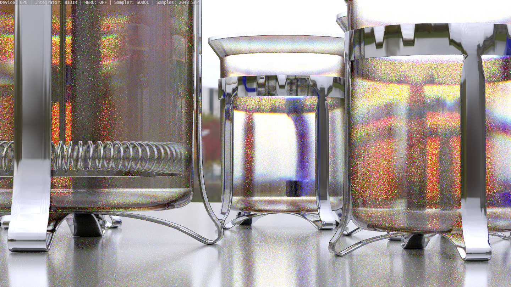
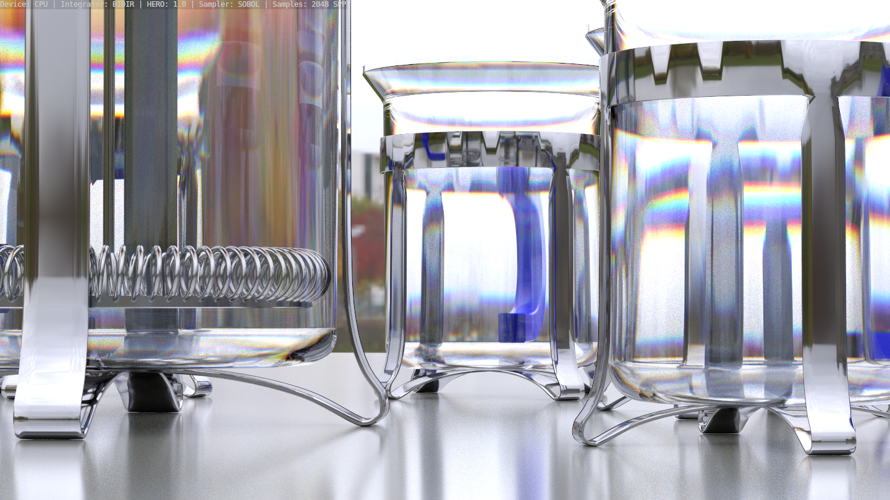

# LuxCore ML-HERO Experimental

## Visual Comparison

### LuxCore Standard vs. ML-HERO Spectral Rendering

The following renders use the same scene, camera, lighting and render settings.

**Render settings:** CPU · BIDIR · SOBOL · 2048 SPP

| LuxCore Standard — HERO OFF | ML-HERO — HERO 1.0 |
|:---:|:---:|
|  |  |

The standard LuxCore dispersion shows significant chromatic noise and fragmented color separation.

With ML-HERO enabled, the wavelength remains coherent through the light path. This produces much cleaner and more continuous spectral dispersion, especially around glass edges, reflections and refractive caustic regions.

> **Same scene. Same integrator. Same sampler. Same 2048 SPP.**
> The primary difference is the ML-HERO spectral wavelength handling.

Experimental LuxCoreRender branch for ML-HERO spectral rendering research.

## Current Status
This `main` branch contains active development and experimental features such as:

- HERO wavelength sampling
- Cauchy and Sellmeier glass dispersion
- RoughGlass Sellmeier support
- CPU/GPU spectral glass experiments
- Tabulated spectral data experiments
- Spectral volume absorption tests

The `master` branch is kept as a reference to the original LuxCore history.

> ⚠️ **Experimental project**
>
> This branch is not intended as a drop-in replacement for the official LuxCoreRender release.
> Features may be incomplete, renderer-specific or under active development.
